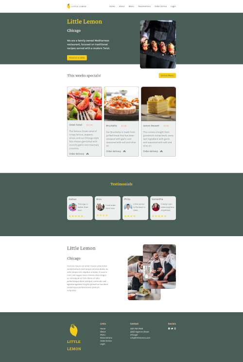
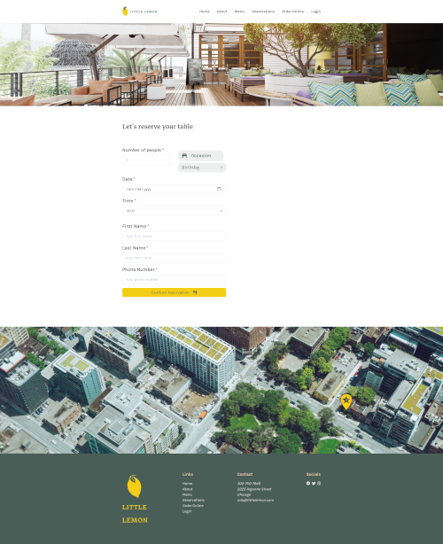

<h1 align="center" id="title">Little Lemon Restaurant</h1>

<p align="center"></p>

<p id="description">Capstone Project for the Meta Front-End specialization. In this project the goal was to solve a real world problem where the owner of the Little Lemon Restaurant has a website for their business but their clients would love to be able to reserve a table online.</p>

<p align="center">&nbsp;&nbsp;
  <br/>
  &nbsp;
  <br/>
  </p>

<h2>🚀 Demo</h2>

[LIVE DEMO](https://little-lemon-restaurant-app.vercel.app/)

## Table Of Contents

- [Table Of Contents](#table-of-contents)
- [About The Project](#about-the-project)
  - [Screenshots](#screenshots)
    - [Main page](#main-page)
    - [Booking page](#booking-page)
  - [Requirements](#requirements)
  - [Optimizations/Problems to solve:](#optimizationsproblems-to-solve)
- [Built With](#built-with)
- [Getting Started](#getting-started)
  - [Prerequisites](#prerequisites)
  - [Creating A Pull Request](#creating-a-pull-request)
- [License](#license)
- [Authors](#authors)

<hr/>

## About The Project

The brand style guide was provided and with it I was able to do the wireframe, prototype and create some components using Figma.
[File](https://www.figma.com/files/recent?fuid=1136340015527445765)

### Screenshots

#### Main page



#### Booking page



### Requirements

- Follow the brand style guide provided and do the wireframe + prototype (Figma file)
- Make use of semantic tags
- Use Open Graph Protocol
- Implement some of the things learned in React (hooks, useEffect, useState, controled components,...)
- Using git version control during the development of the project
- Implement unit tests using Jest

### Optimizations/Problems to solve:

- [ ] make it responsive for all screens
- [ ] show alert when submiting form
- [ ] better unit tests
- [ ] better the performance/speed of the page on page load
- [ ] images optimizations
- [ ] switch the map image for a real map (leaftlet e.g.)

<hr/>

## Built With

- HTML & CSS
- JavaScript - React
- Chakra UI
- Formik and Yup (form validation)
- Jest

<hr/>

## Getting Started

### Prerequisites

You need to have npm installed.

- npm

Quick start:

```sh
$ npm install
$ npm start
```

### Creating A Pull Request

1. Fork the Project
2. Create your Feature Branch (`git checkout -b feature/AmazingFeature`)
3. Commit your Changes (`git commit -m 'Add some AmazingFeature'`)
4. Push to the Branch (`git push origin feature/AmazingFeature`)
5. Open a Pull Request

<hr/>

## License

Distributed under the License. See [LICENSE]() for more information.

<hr/>

## Authors

- **Sílvia Vanessa** - _Software Developer_ - [Sílvia Vanessa](https://github.com/Nessvah)
